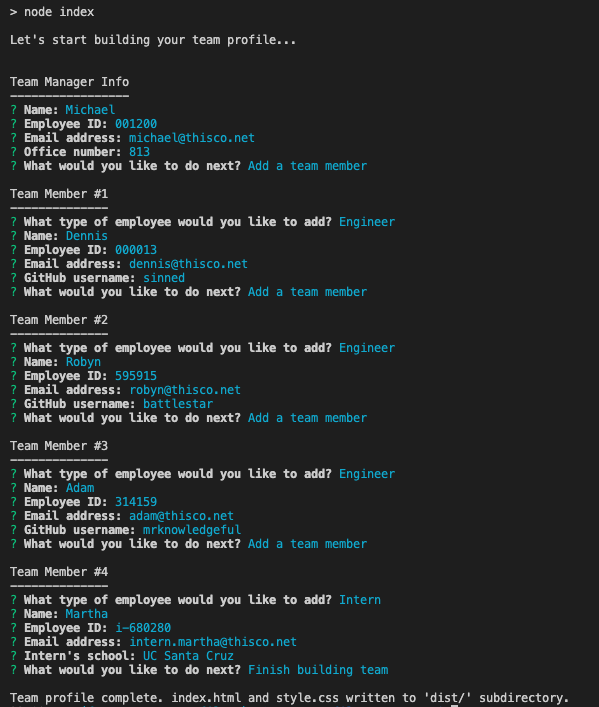
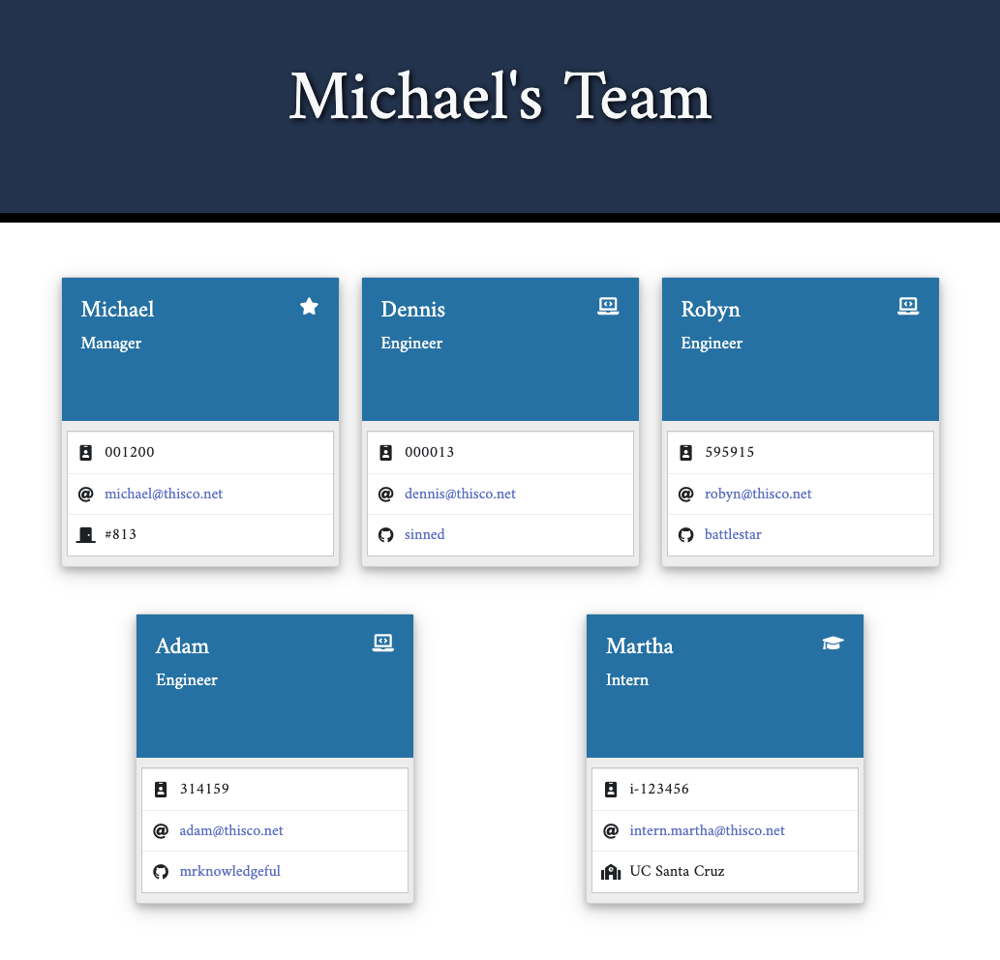

# Team Profile Generator

A command-line node application for managers to use to generate a Team Profile web page displaying their team's info, including contact info and GitHub profile links.

## Features

* Prompts the user for team member information and generates an HTML file that displays a nicely formatted team roster based on the entered information
* Upon starting the application, the user is first prompted for the team manager’s name, employee ID, email address, and office number
* When the team manager’s information has been entered, the user is given the option toadd an engineer or an intern or to finish building the team profile
* Selecting the engineer option results in prompts for the engineer’s name, ID, email, and GitHub username
* Selecting the intern option results in prompts for intern’s name, ID, email, and school
* After each employee is entered, the user is given the option to continue adding employees, or to finish building the team profile
* Each employee card includes a clickable (mailto) email address
* Engineer cards include the employee's GitHub username, linked to their GitHub profile
* When the user decides to finish building the team profile, an HTML page is generated and written to an `index.html` file in the project's `dist/` subdirectory, along with a `style.css` file, and the application exits

## Installation

1. Make sure recent versions of Node.js and NPM are installed in your environment.
2. Clone this repository (https://github.com/costanza13/readme-generator).
3. Run `npm install` in the project's root directory to install the necessary modules.

## Usage

Run `node index` in the project's root directory and follow the prompts.

* See a video walkthrough [here](https://drive.google.com/file/d/1v3e_llraujVjnhDu8O3VglKmtuk1P73u/view?usp=sharing).

## Tests

* Run `npm run test` from the project root directory.

## License

 This software is made available under the [Unlicense](http://unlicense.org/) license.

## Credits

* [Inquirer.js](https://github.com/SBoudrias/Inquirer.js) - command-line question and answer UI by [Simon Boudrias](https://github.com/SBoudrias)
* [Jest](https://github.com/facebook/jest) - JavaScript testing framework
